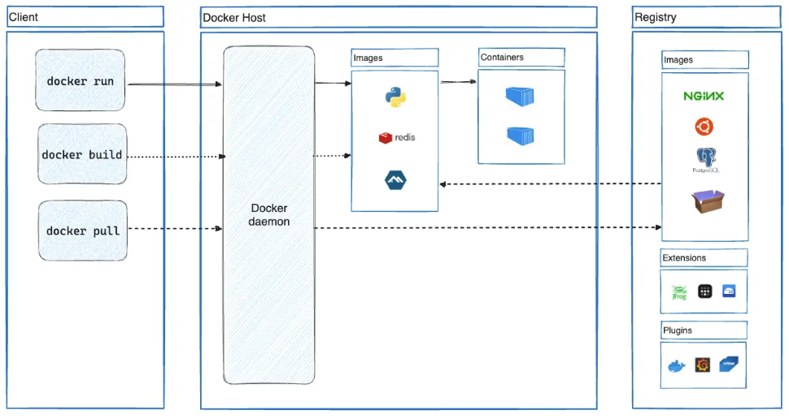

Файлы отвечающие за работу докера внедряются в код самого проекта, таким образом перемещая проект
мы перемещаем конфигурацию докера

> Вы можете делиться контейнерами во время работы и быть уверенным, что все, с кем вы делитесь, получат тот же контейнер, который работает таким же образом.

Docker provides tooling and a platform to manage the lifecycle of your containers:

- Develop your application and its supporting components using containers.
- The container becomes the unit for distributing and testing your application.
- When you're ready, deploy your application into your production environment, as a container or an **orchestrated service**. This works the same whether your production environment is a local data center, a cloud provider, or a hybrid of the two.

### Для чего я могу использовать Docker?
- Быстрая и последовательная доставка ваших заявок
Оптимизирует жизненный цикл разработки, позволяя разработчикам работать в стандартизированных средах, используя локальные контейнеры. Контейнеры отлично подходят для рабочих процессов непрерывной интеграции и непрерывной доставки (CI/CD).

- Оперативное развертывание и масштабирование
Контейнерная платформа Docker позволяет выполнять высокопортативные рабочие нагрузки.

Портативность и легкость Docker также позволяют легко динамически управлять рабочими нагрузками, масштабируя или удаляя приложения и сервисы в зависимости от потребностей бизнеса практически в реальном времени.

- Выполнение большего количества рабочих нагрузок на том же оборудовании
Docker — легкий и быстрый. Он предоставляет жизнеспособную, экономически эффективную альтернативу виртуальным машинам на основе гипервизора, поэтому вы можете использовать больше мощности сервера для достижения своих бизнес-целей.

### Архитектура докера
Докер использует клиент серверную архитектуру для реализации своего функционала. Демон и клиент могут работать ЛИБО на одной машине ЛИБО через удалённый доступ к демону.



- Docker clinet - `docker` - `docker compose` - представляет собой консольный интерфейс docker и docker compose; используется для того чтобы общатся с docker daemon. Когда мы вводим какие то команды клиент отправляет их демону.
- Docker deamon - `dockerd` - слушает API запросы docker и управляет объектами Docker - контейнерами, сетями и томами (volumes). Демон так же может взаимодействовать с другими демонами.
- Docker registry - место для хранения имеджей. Docker Hub - пример публичного реестра, который может использовать каждый, так же при желании можно создать свой, частный реестр. Обычно мы используем DR для того чтобы стянуть какой-то имедж, на основе которого мы создадим свой или для того чтобы сохранить наш имедж. <br>
! если мы создали свой имедж на основе другого и не запушили его никуда, то он просто хранится у нас на машине в **docker кэше**. Если другой человек запустит на своей машине НАШ КОД С НАШЕЙ КОНФИГУРАЦИЕЙ, то у него будет точно такой же контейнер, с таким же поведением. Т. е. *контейнер разные, они не в одном registry, но ПОВЕДЕНИЕ у них ОДИНАКОВОЕ из-за одинаковой конфигурации*


### Объекты докер
- `image` - имеджы - read-only шаблон с инструкциями по созданию docker контейнера. **Чаще всего образ основан на другом образе с некоторой дополнительной надстройкой**. Например может быть image с образом ubuntu, но если я поверх него установлю веб сервер nginx, его конфигурацию и настройки, то это всё я могу запаковать в свой образ и назвать например nginx-ubuntu.
Чтобы создать свой образ нужно создать Dockerfile (либо сервис с docker compose) и в нём, с помощью специального синтаксиса, нужно определить шаги, необходимые для создания образа (image) и его запуска
- `containers` - контейнеры - собранный, запускаемый экземпляр образа. Контейнер можно создать, запустить, остановить, переместить, удалить контейнер с помощью Docker API или CLI. Можно подключить контейнер к одной или нескольким сетям, присоеденить к нему хранилище или создать **новый образ** на основе его текущего состояния. Контейнер изолирован от других контейнеров. Можно контроллировать насколько будет изолирована сеть, хранилище или другие подсистемы контейнера.
Контейнер определяется его образом, а также любыми параметрами, которые вы ему предоставляете при создании/запуске. *Когда контейнер удаляется, любые изменения его состояния, которые не сохраняется в постоянном хранилище, исчезают.*

### Пример запуска контейнера
> docker run -i -t ubuntu /bin/bash

```plaintext
# нету образа локально
Unable to find image 'ubuntu:latest' locally
latest: Pulling from library/ubuntu
# имедж скачан
5a7813e071bf: Download complete
Digest: sha256:
Status: Downloaded newer image for ubuntu:latest
# запускает контейнер и запускает в нём баш
root@3591f18c6daf:/#
```

Что происходит:
1. Если нету локального имеджа `ubuntu` - `dockerd` соединяется с докер хаб и стягивает его на машину, будто бы мы написали `docker pull ubuntu` вручную
2. Docker **создаёт новый контейнер**, как если бы мы запустили `docker container create` вручную (команда создаёт контейнер из указанного имеджа)
3. Докер выделяет файловую систему для чтения-записи под контейнер, в качестве **его последнего слоя**. Это позволяет работающему контейнеру создавать или изменять файлы и каталоги в своей локальной файловой системе.
4. Потом докер создаёт **сетевой интерфейс** для подключения контейнера к сети *по умолчанию*, потому что мы не указывали никаких сетевых параметров. Это включает назначение IP-адреса контейнеру. По умолчанию контейнеры могут подключаться к внешним сетям, используя сетевое подключение хост-машины.
5. Контейнер запускается, а в самом контейнере запускается `/bin/bash`; с помощью флага `-t` мы подсоединеям контейнер к терминалу (видно вывод) и с помощью флага `-i` делаем контейнер интерактивным и можем вводить данные с клавиатуры
6. При запуске команды `exit` в контейнере, он останавливается *но не удаляется*. Его можно снова запустить или удалить


### Технологии
Докер написан на Go и использует технологию, называемую `namespaces` для предоставления изолированного рабочего пространства, называемого **контейнером**. Когда мы запускаем контейнер, докер создаёт набор пространств имен для этого контейнера.

Эти пространства имен обеспечивают уровень изоляции. Каждый аспект контейнера выполняется в отдельном пространстве имен, и его доступ ограничен этим пространством имен.


 > Что такое образ/Dockerfile?

Не вдаваясь пока слишком глубоко, представьте себе образ контейнера как единый пакет, содержащий все необходимое для запуска **процесса**. В этом случае он будет содержать среду Node, код бэкэнда и скомпилированный код React.

Любая машина, на которой запущен контейнер с использованием образа, сможет запустить приложение в том виде, в котором оно было создано, без необходимости предварительной установки чего-либо еще на машину.

A Dockerfile — это текстовый скрипт, который предоставляет набор инструкций по созданию образа. Для этого быстрого старта репозиторий уже содержит Dockerfile.
